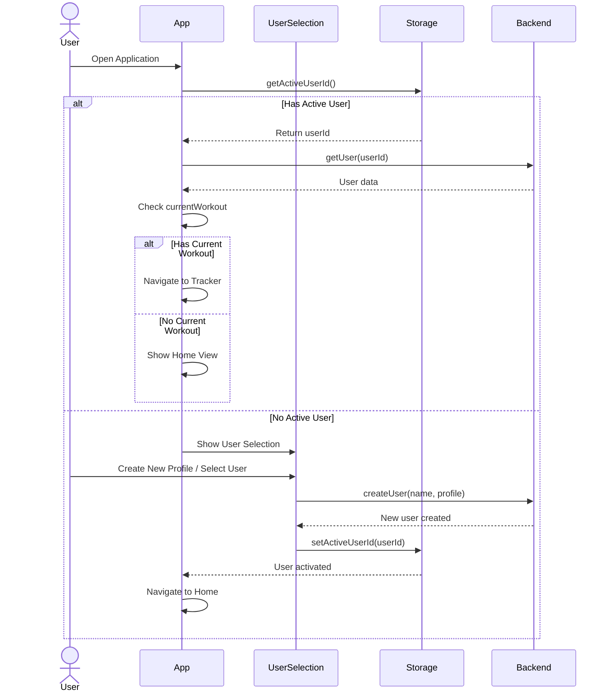

# User Authentication & Onboarding Flow

This diagram shows the complete user authentication and onboarding process, including how the app handles existing users versus new user creation.

## Key Points

- **Auto-login**: If a user was previously active, they're automatically logged in
- **Resume Support**: Detects if there's an active workout and navigates directly to tracker
- **Profile Creation**: Comprehensive user profile setup including fitness level, goals, equipment access
- **Backend Sync**: All user data stored in backend API (`/api/users`)
