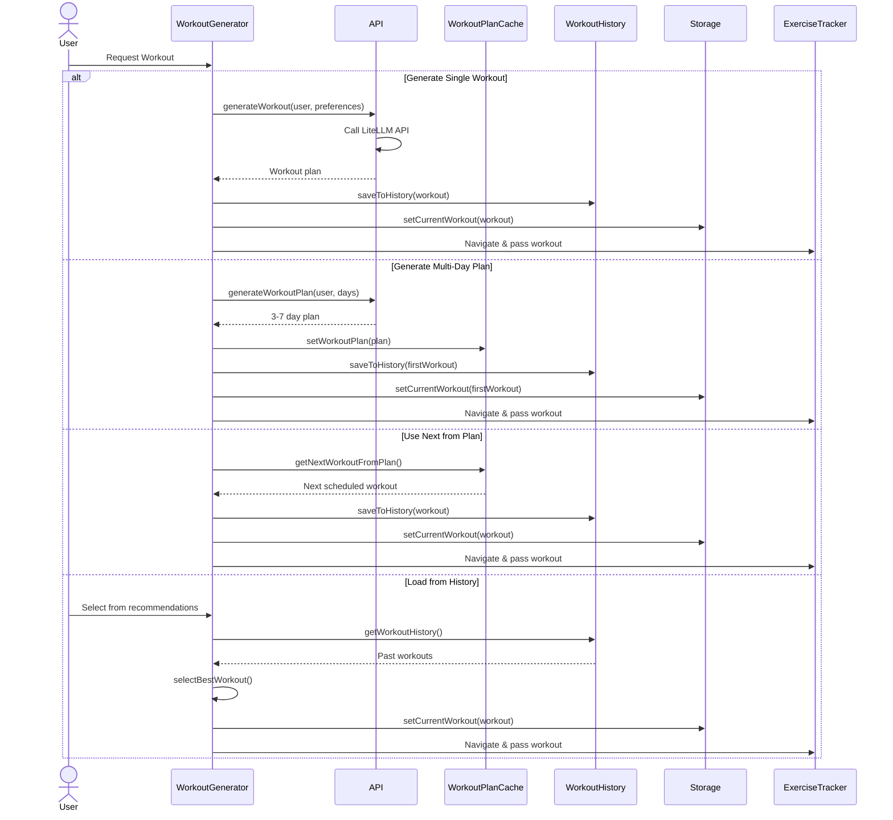

# Workout Generation Flow

This diagram illustrates the four different ways workouts can be generated in the application, each optimized for different user needs.

## Workout Generation Methods

### 1. Single Workout Generation
- **Use Case**: Quick, one-time workout
- **AI Generated**: Yes
- **Customizable**: User can specify focus, equipment, activity type

### 2. Multi-Day Plan (3-7 days)
- **Use Case**: Structured weekly training program
- **Caching**: Plan cached for sequential use
- **Progressive**: Each day builds on previous

### 3. Next from Cached Plan
- **Use Case**: Continue existing multi-day plan
- **Performance**: No API call needed
- **Scheduling**: Workouts have scheduled dates

### 4. Load from History
- **Use Case**: Repeat successful workouts
- **Smart Selection**: Algorithm chooses best based on effectiveness
- **Progressive Overload**: Automatically increases weights if PRs were achieved
