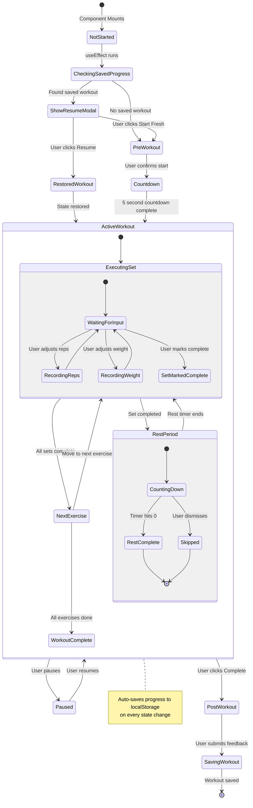

# Exercise Tracker Lifecycle & State Management

This state diagram shows the complete lifecycle of a workout session from initial load to completion, including all possible state transitions.

## State Descriptions

### NotStarted
- Component just mounted
- No workout activity yet
- Checking for saved progress

### CheckingSavedProgress
- Queries localStorage for in-progress workout
- Validates saved data (must be <24 hours old)
- Checks if workout ID matches current workout

### ShowResumeModal
- Displays saved workout info
- Shows progress (exercise X of Y, set N of M)
- Offers Resume or Start Fresh options

### ActiveWorkout
- Main workout state
- Manages exercise progression
- Handles set completion
- Controls rest periods
- **Auto-saves** on every meaningful state change

### Paused
- All timers stopped
- Paused time tracked for accuracy
- Can resume at any time

### PostWorkout
- Collects user feedback (difficulty, feeling, soreness)
- Optional but recommended for AI learning

### SavingWorkout
- Sends data to AI for feedback
- Saves to backend
- Updates workout history
- Triggers progress summary if needed (every 7 workouts)
