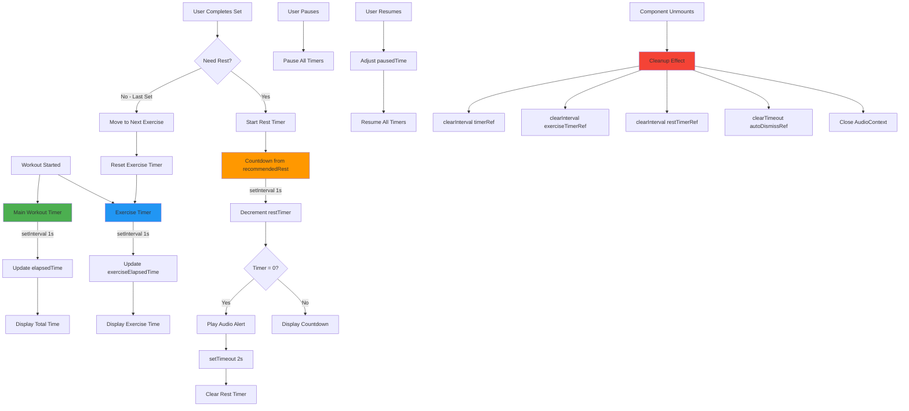

# Timer System Architecture

This diagram details the complete timer system including the three independent timers, their interactions, and cleanup mechanisms.

## Timer Details

### 1. Main Workout Timer (Green)
- **Purpose**: Track total workout duration
- **Update Frequency**: Every 1 second
- **Display**: Top-right corner, white text
- **Persistence**: Continues through all exercises
- **Pause Support**: Yes - tracks paused time separately

### 2. Exercise Timer (Blue)
- **Purpose**: Track time spent on current exercise
- **Update Frequency**: Every 1 second  
- **Display**: Top-right corner, blue text
- **Reset**: When moving to next exercise
- **Use Case**: Helps user see if they're taking too long

### 3. Rest Timer (Orange)
- **Purpose**: Countdown rest period between sets
- **Type**: Countdown (not count-up)
- **Default**: 90s between sets, 120s between exercises
- **Adjustable**: +15s / -15s buttons, preset options (60s, 90s, 120s, 180s)
- **Audio Alert**: Plays sound when timer reaches 0
- **Auto-Dismiss**: Disappears 2 seconds after completion
- **Dismissible**: Can be skipped/closed manually

## Performance Optimizations

### Cleanup on Unmount
All timers are properly cleaned up to prevent memory leaks:
1. Clear all `setInterval` timers
2. Clear `setTimeout` for auto-dismiss
3. Close `AudioContext` to free resources

### Pause Behavior
- Accumulates paused time separately
- Adjusts elapsed calculations to exclude paused periods
- All timers stop during pause

### Audio Context Reuse
- Single `AudioContext` reused for all rest alerts
- Prevents hitting browser's 6-context limit
- Gracefully degrades if audio fails
