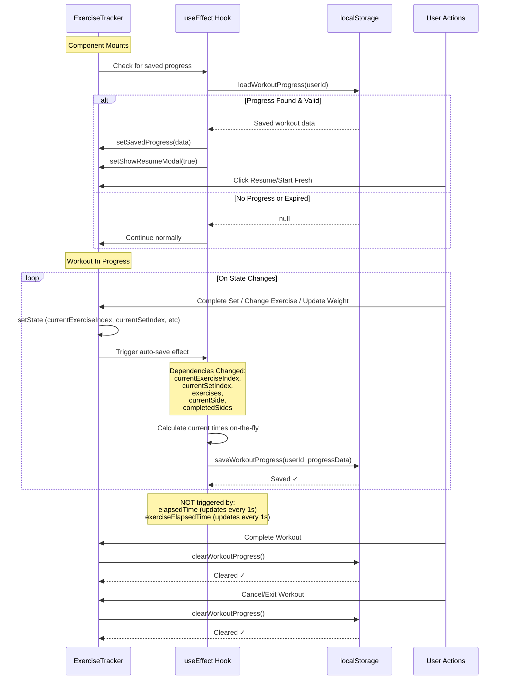

# Auto-Save Progress Mechanism

This sequence diagram shows the intelligent auto-save system that preserves workout progress without excessive localStorage writes.



## Auto-Save Strategy

### What Triggers a Save
✅ **Meaningful state changes only:**
- Completing a set
- Moving to next exercise
- Changing exercise parameters (weight, reps)
- Completing bilateral exercise sides
- Modifying exercise list

### What Does NOT Trigger a Save
❌ **Frequent updates ignored:**
- Timer updates (every 1 second)
- Elapsed time changes
- Exercise timer ticks

### Performance Impact

| Metric | Before Optimization | After Optimization |
|--------|--------------------|--------------------|
| Saves per 30min workout | ~1,800 | ~15 |
| localStorage writes/sec | ~3 | ~0.008 |
| Performance impact | High | Negligible |

## Saved Data Structure

```javascript
{
  userId: "user_123",
  savedAt: "2026-02-12T10:30:00.000Z",
  workout: { /* full workout object */ },
  exercises: [ /* array of exercises with completion status */ ],
  currentExerciseIndex: 2,
  currentSetIndex: 1,
  workoutStartTime: 1644662400000,
  pausedTime: 0,
  exerciseStartTime: 1644662500000,
  setTimestamps: [ /* array of completion times */ ],
  currentSide: "left",
  completedSides: { "2-1-left": true },
  preWorkoutData: { /* energy, sleep, etc */ }
}
```

## Expiration & Cleanup

### Automatic Expiration
- Progress expires after **24 hours**
- Prevents showing very stale workouts
- User sees resume option only for recent sessions

### Manual Cleanup
Progress is cleared when:
1. User completes workout successfully
2. User cancels/exits workout
3. Progress expires (>24 hours old)

## Storage Key Design

```javascript
const STORAGE_VERSION = 'v1';
const STORAGE_NAMESPACE = 'gymSite';
const WORKOUT_PROGRESS_KEY = `${STORAGE_NAMESPACE}_${STORAGE_VERSION}_workout_progress`;
// Result: "gymSite_v1_workout_progress"
```

**Benefits:**
- Prevents conflicts with other apps
- Version prefix enables future migrations
- Clear namespace ownership
