# Component Architecture & Data Flow

This diagram shows the overall application architecture, component relationships, and data flow patterns.

```mermaid
graph TB
    App[App.jsx]
    
    App --> UserSel[UserSelection]
    App --> CoachSel[CoachSelector]
    App --> WorkoutGen[WorkoutGenerator]
    App --> Tracker[ExerciseTracker]
    App --> History[History]
    App --> Progress[Progress]
    App --> ManualLog[ManualWorkoutLog]
    
    subgraph "Context Providers"
        CoachCtx[CoachContext]
        CoachCtx --> Coach[Coach Avatar & Messages]
        CoachCtx --> Confetti[Canvas Confetti]
    end
    
    subgraph "Storage Layer"
        Storage[storage.js]
        Storage --> Backend[Backend API /api/users]
        Storage --> LocalSt[localStorage]
    end
    
    subgraph "Services"
        API[api.js]
        API --> LiteLLM[LiteLLM API]
    end
    
    subgraph "Utils"
        WHist[workoutHistory.js]
        WPlan[workoutPlanCache.js]
        WSel[workoutSelector.js]
    end
    
    App --> |Wraps| CoachCtx
    App --> |Calls| Storage
    
    WorkoutGen --> |Generate| API
    WorkoutGen --> |Save| WHist
    WorkoutGen --> |Cache| WPlan
    WorkoutGen --> |Select| WSel
    
    Tracker --> |ErrorBoundary| EB[ErrorBoundary]
    Tracker --> |Auto-save| LocalSt
    Tracker --> |Complete| API
    Tracker --> |Save| Storage
    
    Tracker --> |Timers| Timers[Timer System]
    Tracker --> |Audio| Audio[AudioContext]
    Tracker --> |Coach| CoachCtx
    
    History --> |Load| WHist
    Progress --> |Analytics| Storage
    
    style App fill:#9C27B0
    style Tracker fill:#2196F3
    style Storage fill:#4CAF50
    style API fill:#FF9800
    style CoachCtx fill:#E91E63
```



## Architecture Layers

### 1. Presentation Layer (Components)
- **App.jsx**: Main router and state coordinator
- **Feature Components**: User, Workout, Progress modules
- **Lazy Loading**: All routes lazy-loaded for performance

### 2. Context Layer
- **CoachContext**: Manages coach personality, motivational messages, confetti
- **Providers**: Wrap entire app for global access

### 3. Service Layer
- **api.js**: LiteLLM API integration for AI workout generation
- **storage.js**: Backend API calls and localStorage management

### 4. Utility Layer
- **workoutHistory.js**: Workout caching and effectiveness tracking
- **workoutPlanCache.js**: Multi-day plan management
- **workoutSelector.js**: Smart workout recommendation algorithm

### 5. Backend Layer
- **Node.js API**: User data persistence
- **LiteLLM**: AI workout generation and feedback

## Data Flow Patterns

### Top-Down (Props)
```
App → ExerciseTracker → { user, workout, callbacks }
```

### Bottom-Up (Callbacks)
```
ExerciseTracker → onComplete() → App refreshes user data
```

### Context (Global State)
```
CoachContext → motivate() → Available everywhere
```

### Storage (Persistence)
```
Component → storage.js → Backend API → JSON file
Component → storage.js → localStorage → Browser
```

## Component Responsibilities

### App.jsx
- View routing (home, tracker, history, progress)
- User session management
- Lazy component loading
- Error boundary wrapper

### ExerciseTracker.jsx (1,500+ lines)
- Workout execution
- Timer management (3 timers)
- Auto-save progress
- Set/rep/weight tracking
- Rest period management
- Pre/post workout feedback
- AI integration for completion

### WorkoutGenerator.jsx
- Single workout generation
- Multi-day plan creation
- Workout recommendation
- History-based workout selection

### Storage.js
- User CRUD operations
- Workout persistence
- Conversation history
- Progress summarization
- Auto-save utilities

## Design Patterns Used

1. **Lazy Loading**: Code splitting for better performance
2. **Context API**: Global coach state
3. **Custom Hooks**: Effect logic extraction (timers, auto-save)
4. **Error Boundaries**: Graceful error handling
5. **Memoization**: Performance optimization (React.memo, useCallback)
