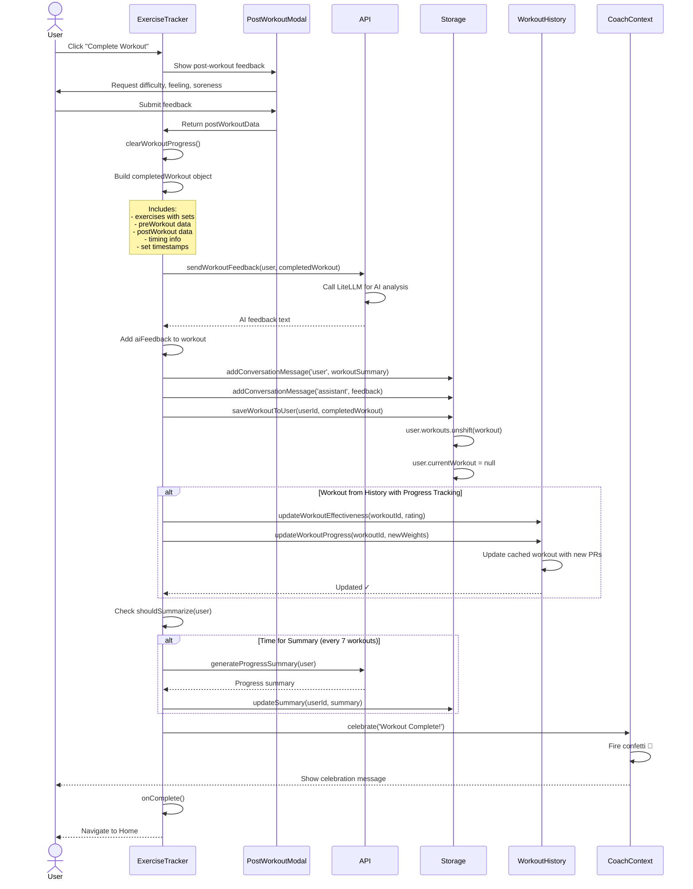

# Workout Completion & Feedback Loop

This sequence diagram shows the comprehensive workflow when a user completes a workout, including AI feedback, data persistence, and celebration.



## Completion Workflow Steps

### 1. Post-Workout Feedback Collection
User provides optional but valuable data:
- **Difficulty** (1-10 scale)
- **Overall Feeling** (exhausted → amazing)
- **Expected Soreness** (none → severe)
- **Notes** (free text)

### 2. Workout Data Compilation
System builds comprehensive workout object:

```javascript
{
  ...originalWorkout,
  exercises: [...], // with completion status
  completedAt: "2026-02-12T11:30:00.000Z",
  date: "2026-02-12",
  setTimestamps: [...], // exact completion times
  totalDuration: 2400, // seconds
  preWorkout: { energyLevel, sleep, stress, etc },
  postWorkout: { difficulty, feeling, soreness, notes },
  aiFeedback: "..." // added after AI call
}
```

### 3. AI Feedback Generation
Sends to LiteLLM API with:
- User profile and history
- Completed workout details
- Pre/post workout data
- Exercise performance

AI analyzes and provides:
- Performance assessment
- Form recommendations
- Progressive overload suggestions
- Volume/intensity feedback

### 4. Data Persistence

**Backend Storage:**
- Saves to `user.workouts` array  
- Clears `user.currentWorkout`
- Updates conversation history

**Cleanup:**
- Clears auto-save progress from localStorage
- Resets all workout state

### 5. Progressive Overload Tracking

If workout came from history:
- **Effectiveness Rating**: Converted from difficulty (10 difficulty = 1 rating, 1 difficulty = 5 rating)
- **PR Detection**: Checks if weights increased
- **Cache Update**: Updates cached workout with new weights for next time

### 6. Progress Summarization

Triggers every 7 workouts:
- Calls LiteLLM to analyze last 7 workouts
- Generates comprehensive progress summary
- Updates `user.progressSummary` field
- Used for future workout planning

### 7. Celebration 🎉

CoachContext triggers:
- Canvas confetti animation
- Celebratory message from coach
- Sound/visual feedback
- Motivational quote

## Data Flow Visualization

```
User Input
    ↓
Post-Workout Modal
    ↓
ExerciseTracker (build object)
    ↓
    ├─→ AI API (feedback)
    ├─→ Storage (persist)
    ├─→ History (progressive overload)
    ├─→ AI API (summarization if needed)
    └─→ Coach (celebration)
    ↓
Navigate Home
```

## Error Handling

- AI API failures don't block workout save
- Saves workout even if feedback generation fails
- Logs errors for debugging
- User still gets celebration and navigation
