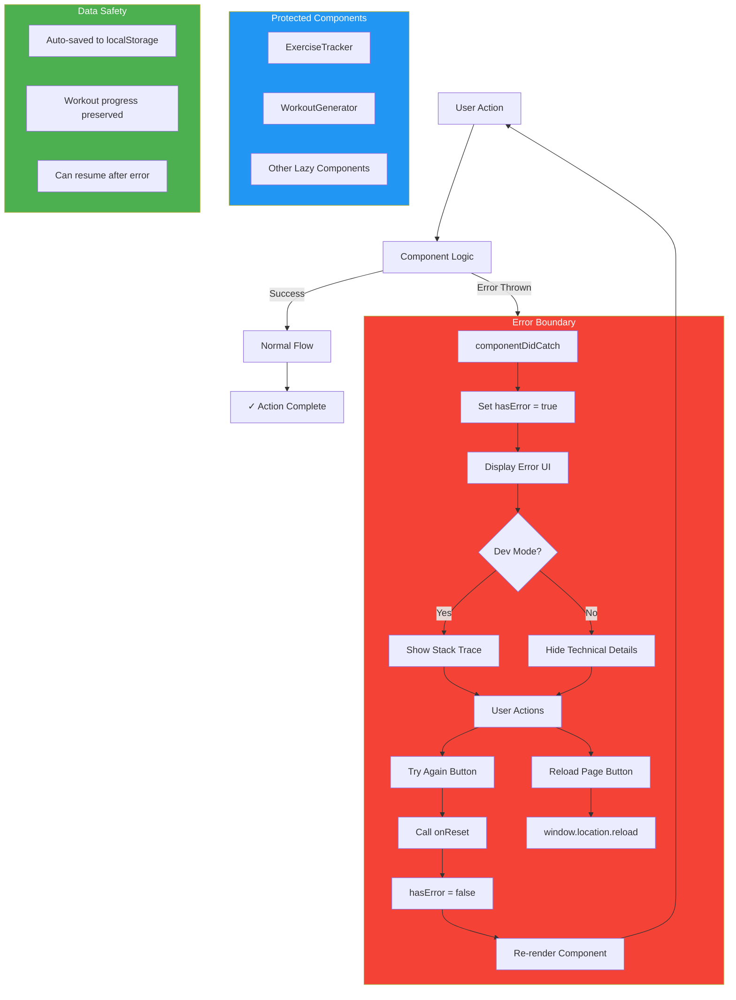

# Error Handling & Recovery Flow

This diagram illustrates the comprehensive error handling system that protects user data and provides graceful recovery options.



## Error Boundary Implementation

### Class Component
ErrorBoundary is a React class component that implements:

```javascript
class ErrorBoundary extends React.Component {
  static getDerivedStateFromError(error) {
    return { hasError: true };
  }
  
  componentDidCatch(error, errorInfo) {
    console.error('ErrorBoundary caught:', error, errorInfo);
  }
}
```

### Error UI Features

**Development Mode:**
- Full error message displayed
- Component stack trace (collapsible)
- Detailed debugging information
- Helps developers diagnose issues quickly

**Production Mode:**
- User-friendly error message
- No technical details shown
- Clear recovery instructions
- Professional appearance

### Recovery Options

1. **Try Again Button**
   - Calls custom `onReset()` callback
   - Clears error state
   - Re-renders component
   - User can attempt action again

2. **Reload Page Button**
   - Full page refresh
   - Clears all React state
   - Reloads from backend
   - Last resort option

## Protected Components

### ExerciseTracker
**Wrapped Implementation:**
```jsx
<ErrorBoundary
  title="Workout Tracker Error"
  message="Don't worry! Your workout progress is auto-saved."
  onReset={() => {
    setCurrentWorkout(null);
    setView('home');
    refreshUserData();
  }}
>
  <ExerciseTracker {...props} />
</ErrorBoundary>
```

**Why Critical:**
- Handles complex state (18+ state variables)
- Manages timers (3 concurrent timers)
- Controls audio playback
- Most crash-prone component

### Other Lazy Components
All lazy-loaded components benefit from Suspense error boundaries:
- WorkoutGenerator
- History
- Progress
- ManualWorkoutLog
- Achievements

## Data Safety Guarantees

### Auto-Save Protection
Even if ExerciseTracker crashes:
1. Progress is saved to localStorage
2. User can refresh page
3. Resume modal appears
4. Full state recovered

### Failure Scenarios Handled

| Scenario | Data Loss? | Recovery |
|----------|-----------|----------|
| Timer malfunction | ❌ No | Auto-save preserves state |
| API call failure | ❌ No | Workout saves without AI feedback |
| Audio context error | ❌ No | Silently degrades, workout continues |
| Render error | ❌ No | Error boundary + auto-save |
| Network failure | ❌ No | Data queued in localStorage |
| Browser crash | ❌ No | Auto-save persists |

### Recovery Flow Example

```
User doing workout
    ↓
Error occurs in ExerciseTracker
    ↓
ErrorBoundary catches error
    ↓
Shows user-friendly message
    ↓
User clicks "Try Again"
    ↓
Component re-mounts
    ↓
Checks localStorage for saved progress
    ↓
Shows resume modal
    ↓
User clicks "Resume"
    ↓
✓ Workout continues from exact point of failure
```

## Error Prevention Measures

Beyond ErrorBoundary, the app includes:

1. **Try-Catch Blocks**: Audio playback, API calls
2. **Null Checks**: All user data accesses
3. **Default Values**: Fallbacks for missing data
4. **Validation**: Input sanitization
5. **Cleanup**: Proper useEffect cleanup to prevent memory leaks

## Monitoring & Logging

```javascript
componentDidCatch(error, errorInfo) {
  // Log to console (development)
  console.error('ErrorBoundary caught error:', error, errorInfo);
  
  // In production, could log to service:
  // logErrorToService(error, errorInfo);
}
```

**Future Enhancement Opportunity:**
- Integrate error tracking (Sentry, LogRocket)
- Capture user session replay
- Track error frequency
- Alert on critical errors
