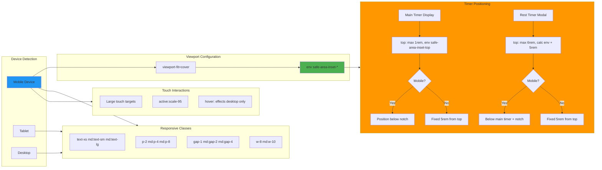

# Mobile Responsive & Safe Area Handling

This diagram details the mobile-first responsive design strategy and iOS safe area support.



## Mobile-First Design Strategy

### Viewport Configuration

**HTML Meta Tag:**
```html
<meta name="viewport" content="width=device-width, initial-scale=1.0, viewport-fit=cover">
```

**Key Properties:**
- `width=device-width`: Responsive width
- `initial-scale=1.0`: No zoom
- `viewport-fit=cover`: **iOS notch support**

### Safe Area Insets (iOS Support)

**CSS Environment Variables:**
```css
top: max(1rem, env(safe-area-inset-top));
```

**Supported Insets:**
- `env(safe-area-inset-top)` - iPhone notch
- `env(safe-area-inset-bottom)` - iPhone home indicator
- `env(safe-area-inset-left)` - Landscape mode
- `env(safe-area-inset-right)` - Landscape mode

## Timer Positioning Strategy

### Main Timer Display
**Mobile (<768px):**
```jsx
style={{
  top: 'max(1rem, env(safe-area-inset-top))'
}}
```
- Positioned below notch dynamically
- Falls back to 1rem if no notch

**Desktop (≥768px):**
```css
@media (min-width: 768px) {
  top: 5rem;
}
```

### Rest Timer Modal
**Mobile:**
```jsx
style={{
  top: 'max(6rem, calc(env(safe-area-inset-top) + 5rem))'
}}
```
- Positioned below main timer + notch
- Prevents overlap

**Desktop:**
- Fixed at 5rem from top
- Centered horizontally

## Responsive Class System

### Tailwind Breakpoints
```javascript
// Default (mobile-first)
text-xs    // < 768px
p-2        // < 768px
gap-1      // < 768px

// Medium (tablet)
md:text-sm  // ≥ 768px
md:p-4      // ≥ 768px
md:gap-2    // ≥ 768px

// Large (desktop) - implicit
// ≥ 1024px if needed
```

### Component Examples

**Timer Display:**
```jsx
className="text-lg md:text-2xl"
// Mobile: 18px
// Desktop: 24px
```

**Button Sizes:**
```jsx
className="w-8 h-8 md:w-10 md:h-10"
// Mobile: 32×32px
// Desktop: 40×40px
```

**Spacing:**
```jsx
className="gap-2 md:gap-4"
// Mobile: 8px
// Desktop: 16px
```

## Touch Interaction Optimization

### Large Touch Targets
**Minimum Sizes:**
- Mobile buttons: 44×44px (Apple guideline)
- Desktop buttons: 40×40px
- Text inputs: Minimum 44px height

### Active States
```jsx
className="active:scale-95"
```
- Provides tactile feedback
- Visual confirmation of tap
- Only on touchscreens

### Hover Effects (Desktop Only)
```jsx
className="hover:bg-blue-700"
```
- Disabled on touch devices
- Prevents sticky hover states
- Desktop-only visual feedback

## Responsive Layout Patterns

### Stack on Mobile, Grid on Desktop
```jsx
className="flex flex-col md:grid md:grid-cols-3"
```

### Hide on Mobile
```jsx
className="hidden md:block"
```

### Full Width on Mobile
```jsx
className="w-full md:w-auto"
```

## Device-Specific Considerations

### iPhone X and Newer
- Notch at top (safe-area-inset-top)
- Home indicator at bottom (safe-area-inset-bottom)
- Rounded corners

### Android Devices
- Navigation bar (handled by browser)
- Status bar (handled by browser)
- Various aspect ratios

### Tablets
- Larger screens but touch input
- Use medium breakpoint (md:)
- Touch targets still important

## Performance Considerations

### Reduced Motion
```css
@media (prefers-reduced-motion: reduce) {
  * {
    animation-duration: 0.01ms !important;
    transition-duration: 0.01ms !important;
  }
}
```

### Dark Mode Support
```css
@media (prefers-color-scheme: dark) {
  /* Already using dark theme by default */
}
```

## Testing Checklist

- [ ] iPhone X/11/12/13/14 (notch)
- [ ] iPhone SE (no notch)
- [ ] iPad (tablet)
- [ ] Android phones (various sizes)
- [ ] Landscape orientation
- [ ] Portrait orientation
- [ ] Rotation behavior
- [ ] Keyboard appearance
- [ ] Touch target sizes
- [ ] Swipe gestures (shouldn't conflict)
